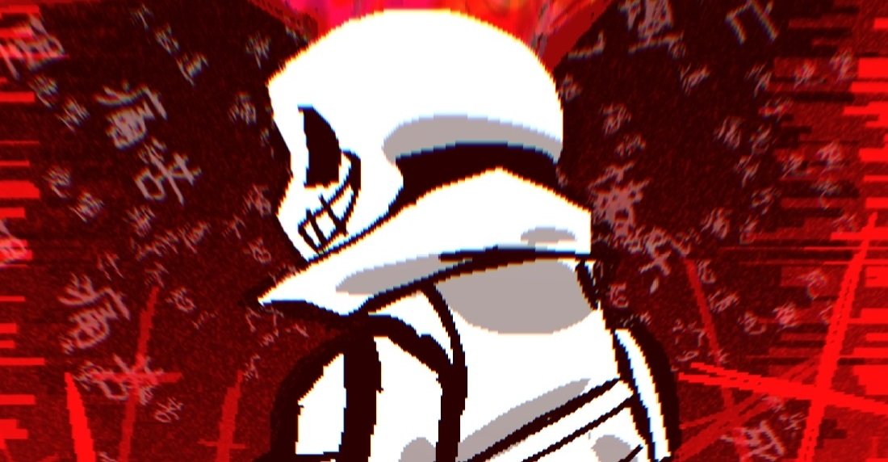

<h1 align="center">HeZhijun4030 Py/Ja/C+ Personal developer🤔</h1>

---

> Open your eyes we are just alone.

---

    
    

---

### 👨‍💻 About Me  
- A middle school student 
- Constantly exploring and expanding my coding skills
- Participants in the Undertale community
- ~~Teenage psychology expert(?)~~
---

**Organization: CodeManStudio **  
**Partners: CIPStudio**

- 📫 Contact: zhijun4030@outlook.com
- QQ: 419783120

---

### 🚀 Tech Stack

**Languages:**

**IDEs & Tools:**

**Pipes:**

**The SUPREME symbol:**

---

> In sin we both partake, yet it's mercy you doth forsake. What's real this time? Simply feel and find the meaning.  

> 我们同在罪恶之中，你却选择宽恕。此时此刻，何为真实？只需感受并探寻其意义。
